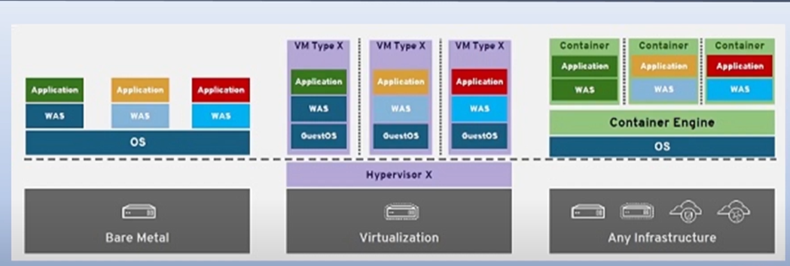

# Docker 기초 공부

## 0. 예비 실습

[도커와 마이크로서비스 이해1 ](https://www.notion.so/1-301bfb1aaafe4d81bcfdfc8e809dcf96?pvs=21)

[도커와 마이크로서비스 이해2 ](https://www.notion.so/2-6f9ae8bda39447a38e621bf4a9f3278f?pvs=21)

[도커 컨테이너 활용법 이론 ](https://www.notion.so/58f0095963d744099b7154466aa3da40?pvs=21)

[도커 컨테이너 환경 구축 ](https://www.notion.so/18cabc0e5a7c476bb0795f146d5e9488?pvs=21)

[도커 컨테이너 실행 및 정보 확인 ](https://www.notion.so/0302a8371e9c4abdb5daf246add3f698?pvs=21)

[도커 컨테이너 여러개 동작 내부쉘 ](https://www.notion.so/dbabcffb8bab4dc3ac1b43d3639e542d?pvs=21)

[도커 컨테이너 웹 페이지 수정 방법 ](https://www.notion.so/993b3edf49554dcbaa82096ed4b00b76?pvs=21)

[도커 이미지 변경 후 허브에 업로드 ](https://www.notion.so/9795ab6bfb90440ab79767dbf0f63e6f?pvs=21)

[도커 볼륨 생성 및 활용 ](https://www.notion.so/e5916caec4b64723bd914a6649acfae8?pvs=21)

[도커 볼륨을 이용한 데이터베이스 운영 ](https://www.notion.so/c5a58699bfca452bbbc1fc1a508504e3?pvs=21)

[도커 네트워크 생성 및 활용 ](https://www.notion.so/4f06a777b4e04451a3140828b8eb51c7?pvs=21)

[동작중인 서버 모를때 ](https://www.notion.so/e3cde728eea54dd29d1d365990218d80?pvs=21)

[도커 볼륨을 활용한 웹페이지 변경 ](https://www.notion.so/098e09662d134c739ae1ea5e9432d9ec?pvs=21)

[도커 로드밸런싱 구축하기 ](https://www.notion.so/ea5b2bc8f4ba4b069db2ae8c9d8cba07?pvs=21)

[도커 파일 활용 이론 ](https://www.notion.so/1f8ac8508045480ca7341186e8df21af?pvs=21)

[도커 파일 활용하기 ](https://www.notion.so/69135f0b44e64528ba9a7ef6c9161903?pvs=21)

[도커 파일로 웹서버와 빌더 구축 ](https://www.notion.so/1defbfa6efbc43cc9202d39295026f2b?pvs=21)

[도커 파일 모범 활용 사례 ](https://www.notion.so/053b4f06a647424694e48092ea4f9ae1?pvs=21)

[도커 파일 불필요한 이미지 ](https://www.notion.so/dd5033843a1b4f14bb4dfdf1fb97886d?pvs=21)

[도커 컴포즈로 워드프레스 환경 구축 ](https://www.notion.so/02047d1055224336b97855f3f6ccf8a5?pvs=21)

[도커 로그 살펴보기 ](https://www.notion.so/84bc663a878e48549748b21dde762d2f?pvs=21)

---

## 1. 컨테이너와 도커의 이해

[[따배도] 1. 컨테이너와 도커의 이해 - 컨테이너를 쓰는이유 / 일반프로그램과 컨테이너프로그램의 차이점](https://www.youtube.com/watch?v=3HId-tpYaZs&list=PLApuRlvrZKogb78kKq1wRvrjg1VMwYrvi&index=2&ab_channel=TTABAE-LEARN)

### 컨테이너를 배우는 이유

### 이 시대가 원한다.

소프트웨어 운영 플랫폼이 바뀌고 있다.

### 왜 리눅스에서 실행할까?

<aside>
💡 리눅스 커널 기능을 써야하니까

</aside>

- chroot - 독립된 공간 형성
- namespace - isolate 기능 지원
- cgroup - 필요한만큼 HW지원

### 일반프로그램과의 차이점

- 하는 일은 같다. 생긴 모양이 다른것

### 도커를 사용하는 이유

<aside>
💡 개발자가 만든 그대로 어디서든 돌아간다. 
확장/축소 쉽고 MSA, DevOps에 적합하다.

</aside>

## 2. 도커 설치하기

[[따배도] 2. 도커 설치하기 - 학습편(준비물/실습 유형 소개)](https://www.youtube.com/watch?v=6S4CXKt6ibE&list=PLApuRlvrZKogb78kKq1wRvrjg1VMwYrvi&index=3&ab_channel=TTABAE-LEARN)

[[따배도] 2-1. 도커 설치하기:  Virtualbox 설치 / VM 생성](https://www.youtube.com/watch?v=PqgWp7rbqws&list=PLApuRlvrZKogb78kKq1wRvrjg1VMwYrvi&index=4&ab_channel=TTABAE-LEARN)

[[따배도] 2-2. 도커 설치하기: 우분투(Ubuntu) 설치](https://www.youtube.com/watch?v=REYVRyXdSKU&list=PLApuRlvrZKogb78kKq1wRvrjg1VMwYrvi&index=6&ab_channel=TTABAE-LEARN)

[[따배도] 2-3. 도커 설치하기: CentOS 설치 및 네트워크 구성](https://www.youtube.com/watch?v=xNby1hi3dow&list=PLApuRlvrZKogb78kKq1wRvrjg1VMwYrvi&index=7&ab_channel=TTABAE-LEARN)

### 도커 설치 준비

1. virturalbox(Hypervisor) 설치 - 네트워크 구성 - VM만들기
2. VM에 Ubuntu 설치하고 기본환경 구성
3. VM에 Centos 설치하고 기본환경 구성
4. Ubuntu/Centos Server에 Docker 설치
5. Windows에 DokcerDesktop 설치

### Virtualbox 설치

[Oracle VM VirtualBox](https://www.virtualbox.org/)

### 네트워크 구성

- Network Manager
    
    
    
- NAT Networks
    
    
    
    
    
    
    
    설정
    

### 가상머신 생성

- 새로만들기 : Linux Ubuntu
    
    
    
    
    
    
    
    
    
    
    
- 설정
    
    
    
    
    
    
    
- Centos 만들기(위랑 똑같이)
    
    
    

### Ubuntu 설치

- 이미지 다운
    
    
    
    [Enterprise Open Source and Linux | Ubuntu](https://ubuntu.com/)
    
    
    
- 추가 설정 및 이미지 추가
    
    
    
    
    
    
    
- 시작 버튼 클릭 - 설정
    
    
    
    
    
    
    
    [VirtualBox 우분투 설치시 버튼 안보일때](https://www.bearpooh.com/101)
    
    
    
    
    
    
    
    
    
- 우분투 환경구성
    
    
    
    
    
- 터미널로 네트워크 구성
    
    
    
    
    
    [리눅스 키보드 오류 해결방법(입력모드 i)](https://m.blog.naver.com/PostView.naver?isHttpsRedirect=true&blogId=dlwjddns5&logNo=220656288619)
    
    
    
    
    
    
    
- 네트워크 테스트
    
    
    
- root 패스워드 설정
    
    
    
    password
    
- 계정전환
    
    
    
- 부팅방식 변경-TEXT모드
    
    
    
- SSH 설치
    
    
    
    
    
    
    
    
    
    
    
- Xshell
    
    [XSHELL - NetSarang Website](https://www.netsarang.com/ko/xshell/)
    
    
    
    
    
    포트포워딩 확인
    
    
    
- 접속
    
    
    
    
    
    
    
- 스냅샷
    
    
    
    메모리 줄이기
    
    
    
    
    

### Centos 설치

[The CentOS Project](https://www.centos.org/)

영상보고 따라하기

### OS에 Docker 설치

- 준비
    
    
    
- 설치
    
    [Docker Docs: How to build, share, and run applications](https://docs.docker.com/)
    
    
    
    
    
- 확인
    
    
    
- 도커 관리자 권한 부여
    
    
    
    도커는 시스템 관리자인 root만 사용가능
    
    
    
    관리자 권한 부여 완료
    

## 3-1. 도커 컨테이너 - 이론

[[따배도] 3-1. 도커 컨테이너 살펴보기: 이론편](https://www.youtube.com/watch?v=m454YTyPWSk&list=PLApuRlvrZKogb78kKq1wRvrjg1VMwYrvi&index=10&ab_channel=TTABAE-LEARN)

### 컨테이너와 컨테이너 이미지

### 컨테이너 동작방식

## 3-2. 도커 컨테이너 - 실습

[[따배도] 3-2. 도커 컨테이너 살펴보기: 실습편](https://www.youtube.com/watch?v=gNsjVOuF2jY&list=PLApuRlvrZKogb78kKq1wRvrjg1VMwYrvi&index=10&ab_channel=TTABAE-LEARN)

### DockerHub에서 이미지 검색

- 준비
    
    
    
    
    
    루트 전환
    
    
    
    세션복제로 하나 더 생성
    
    
    
    버전 확인
    
- 도커 동작 확인
    
    
    
- 이미지 검색
    
    
    

### image 다운로드 후 image layer 보기

- 레이어 확인
    
    
    
    
    
    이미지 없음
    
- 이미지 다운
    
    
    
    
    
    레이어 이미지 5개 다운
    

### 컨테이너 실행 후 확인

- 이미지 확인
    
    
    
- 컨테이너 실행
    
    
    
- 확인
    
    
    
- 중지
    
    
    
- 컨테이너 삭제
    
    
    
- 이미지 삭제
    
    
    

## 4-1. 도커 컨테이너 만들어보기 - 이론

[[따배도] 4-1. 도커 컨테이너 만들어보기: 이론편](https://www.youtube.com/watch?v=9qnD8aODu-4&list=PLApuRlvrZKogb78kKq1wRvrjg1VMwYrvi&index=12&ab_channel=TTABAE-LEARN)

### 무엇을 컨테이너로 만드는가?

### 어떻게 컨테이너를 만드는가?

### 컨테이너를 배포하려면?

## 4-2. 도커 컨테이너 만들어보기 - 실습

[[따배도] 4-2. 도커 컨테이너 만들어보기: 실습](https://www.youtube.com/watch?v=WLjfzwdASbw&list=PLApuRlvrZKogb78kKq1wRvrjg1VMwYrvi&index=13&ab_channel=TTABAE-LEARN)

### 실습 환경 확인 및 Node.js 소스코드 작성

### Docker File 작성

### 컨테이너 이미지 빌드

### 우분투 웹 서버 컨테이너 이미지 만들고 빌드

- 확인
    
    
    

### 만들어놓은 컨테이너 배포하기

- 로그인 → 태그 설정 → 배포
    
    
    
    
    
    
    

## 5-1. 컨테이너 보관창고 - 이론

[[따배도] 5-1. 컨테이너 보관창고 - 이론편](https://www.youtube.com/watch?v=aFIj68YuvzQ&list=PLApuRlvrZKogb78kKq1wRvrjg1VMwYrvi&index=15&ab_channel=TTABAE-LEARN)

### Registry

### Docker hub 사용해보기

### Private Registry 구축

## 5-2. 컨테이너 보관창고 - 실습

[[따배도] 5-2. 컨테이너 보관창고(Docker Registry) - 실습](https://www.youtube.com/watch?v=bQ6XxI0Ep_Q&list=PLApuRlvrZKogb78kKq1wRvrjg1VMwYrvi&index=14&ab_channel=TTABAE-LEARN)

### Public Registry(Docker hub)

- 이미지 검색
    
    
    
- 이미지 다운
    
    
    
- 도커 허브 레파지토리에 업로드
    
    
    
    
    

### Public Registry 운영하기

- 레지스트리 컨테이너 실행
    
    
    
- 로컬 저장소에 업로드
    
    
    
- 확인
    
    
    

## 6-1. Docker 컨테이너 사용 - 이론

[[따배도] 6-1. Docker 컨테이너 사용하기 - 이론편](https://www.youtube.com/watch?v=ild9PzdC0ww&list=PLApuRlvrZKogb78kKq1wRvrjg1VMwYrvi&index=15&ab_channel=TTABAE-LEARN)

### 컨테이너 이미지 사용

### 컨테이너 실행 라이프 사이클

### 동작중인 컨테이너 관리

## 6-2. Docker 컨테이너 사용 -실습

[[따배도] 6-2. Docker 컨테이너 사용하기 - 실습편](https://www.youtube.com/watch?v=wrx-ixvtzxk&list=PLApuRlvrZKogb78kKq1wRvrjg1VMwYrvi&index=16&ab_channel=TTABAE-LEARN)

→ 이미 보안 공부할 때 다해봤던것. 생략

## 7-1. Docker 컨테이너 리소스 관리 - 이론

[[따배도] 7-1. Docker 컨테이너 리소스를 관리해야지 - 이론편](https://www.youtube.com/watch?v=7HA_00KNtbc&list=PLApuRlvrZKogb78kKq1wRvrjg1VMwYrvi&index=17&ab_channel=TTABAE-LEARN)

### 컨테이너 리소스 제한

### Memory 리소스 제한

### CPU 리소스 제한

### Block I/O 제한

### 리소스 모니터링

## 7-2. Docker 컨테이너 리소스 관리 - 실습

[[따배도] 7-2. Docker 컨테이너 리소스를 관리해야지 - 실습편](https://www.youtube.com/watch?v=TM3DvwwvsLg&list=PLApuRlvrZKogb78kKq1wRvrjg1VMwYrvi&index=18&ab_channel=TTABAE-LEARN)

### 부하 테스트 프로그램 - Stress

### Memory 리소스 제한 실습

### CPU 리소스 제한 실습

### Block I/O 제한 실습

### cAdvisor 실행

## 8-1. Docker Container Storage - 이론

[[따배도] 8-1. Docker Container Storage - 이론편](https://www.youtube.com/watch?v=JcgrQnkIePE&list=PLApuRlvrZKogb78kKq1wRvrjg1VMwYrvi&index=19&ab_channel=TTABAE-LEARN)

### 컨테이너 볼륨

### 컨테이너끼리 데이터 공유

## 8-2. Docker Container Storage - 실습

[[따배도] 8-2. Docker Container Storage - 실습편](https://www.youtube.com/watch?v=IHuU3rZATbg&list=PLApuRlvrZKogb78kKq1wRvrjg1VMwYrvi&index=20&ab_channel=TTABAE-LEARN)

### Mysql DB data 영구 보존하기

---

### 웹데이터를 컨테이너에 지원하기

이후 html 수정해도 바로 반영

### 컨테이너끼리 데이터 공유

## 9-1. 컨테이너간 통신(네트워크) - 이론

[[따배도] 9-1. 컨테이너간 통신(네트워크) - 이론편](https://www.youtube.com/watch?v=jOX80bXND2w&list=PLApuRlvrZKogb78kKq1wRvrjg1VMwYrvi&index=21&ab_channel=TTABAE-LEARN)

### 컨테이너는 어떻게 통신하나?

### 컨테이너 포트를 외부로 노출할 수 있나?

### 컨테이너 네트워크를 추가할 수 있나?

### 컨테이너끼리 통신은?

## 9-2. 컨테이너간 통신(네트워크) - 실습

[[따배도] 9-2. 컨테이너간 통신(네트워크) - 실습편](https://www.youtube.com/watch?v=CXrrkl4Zamc&list=PLApuRlvrZKogb78kKq1wRvrjg1VMwYrvi&index=22&ab_channel=TTABAE-LEARN)

### 컨테이너 네트워크 사용하기

### 컨테이너 포트 외부로 노출하기

### user-defined network 구성

### 컨테이너 서비스 운영

## 10-1. 빌드에서 운영까지(Using Docker Compose) - 이론

[[따배도] 10-1. 빌드에서 운영까지 (using Docker Compose) - 이론편](https://www.youtube.com/watch?v=AYRVKB1L0Ak&list=PLApuRlvrZKogb78kKq1wRvrjg1VMwYrvi&index=23&ab_channel=TTABAE-LEARN)

### 도커 컴포즈?

### 도커 컴포즈로 컨테이너 실행이 가능한가?

### 빌드에서 운영까지

## 10-2. 빌드에서 운영까지(Using Docker Compose) - 실습

[[따배도] 10-2. 빌드에서 운영까지 (using Docker Compose) - 실습편](https://www.youtube.com/watch?v=f8yLLWaXtCM&list=PLApuRlvrZKogb78kKq1wRvrjg1VMwYrvi&index=24&ab_channel=TTABAE-LEARN)

### 도커 컴포즈 설치하기

[Try Docker Compose](https://docs.docker.com/compose/gettingstarted/)

### 컨테이너 빌드에서 운영까지

### MySQL 사용하는 WordPress 운영

[awesome-compose/README.md at master · docker/awesome-compose](https://github.com/docker/awesome-compose/blob/master/official-documentation-samples/wordpress/README.md)

